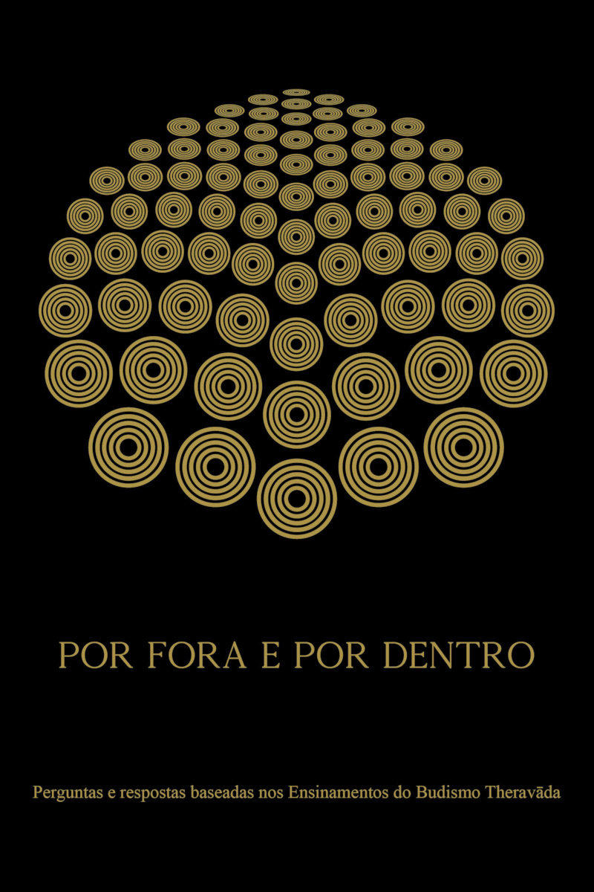

= Por Fora e Por Dentro
:booktitle: {doctitle}
:description: Perguntas e respostas baseadas nos Ensinamentos do Budismo Theravāda
:author: Ajahn Jayasāro
:creator: {author}
:version: v1.1
:revdate: 2020-05-25
:doctype: book
:lang: pt
:pubs-logo: sumedharama-logo-black-w150.jpg
:publisher-name: Publicações Sumedhārāma
:publisher-link-name: www.sumedharama.pt
:publisher-link-url: https://sumedharama.pt
:source: https://forestsangha.org
:keywords: Ajahn Jayasaro, Dhamma, Buddhism, RELIGION / Buddhism / Theravada
:copyright: CC-BY-NC-ND 4.0
:isbn: 978-989-8691-78-1
:identifier: isbn:{isbn}
:imagesdir: assets/photos/92dpi-ebook-sRGB
:includes: manuscript/asciidoc
:front-cover-image: 
:toc: left
:toc-title: Índice
:toclevels: 1

include::{includes}/titlepage.adoc[]

include::{includes}/preface-aj-jayasaro-2020.adoc[]

include::{includes}/preface-bia-2020.adoc[]

// include::{includes}/preface-bia-2013.adoc[]

// include::{includes}/agradecimento-aj-payutto-2013.adoc[]

include::{includes}/introduction.adoc[]

include::{includes}/bencaos.adoc[]

include::{includes}/01-buda.adoc[]

include::{includes}/02-dhamma.adoc[]

include::{includes}/03-sangha.adoc[]

include::{includes}/04-atitudes.adoc[]

include::{includes}/05-budismo-na-tailandia.adoc[]

include::{includes}/06-caminho-da-pratica.adoc[]

include::{includes}/07-recursos.adoc[]

include::{includes}/copyright.adoc[]

